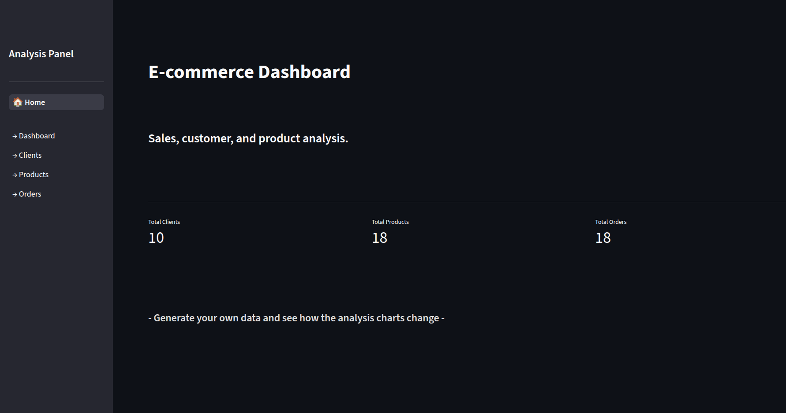
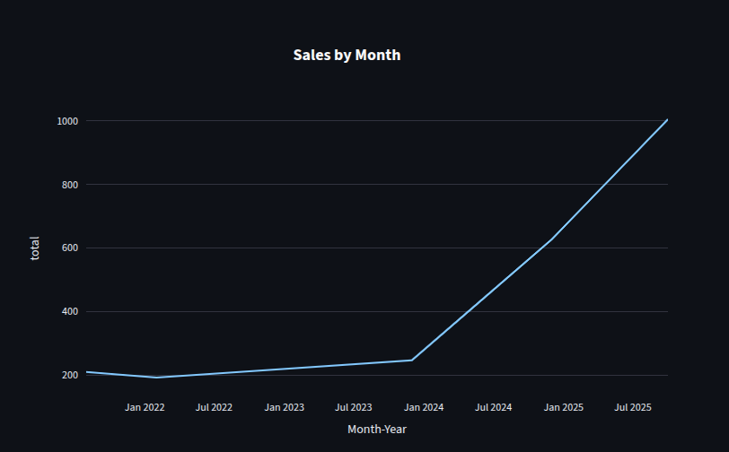
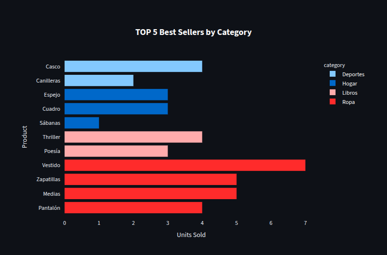
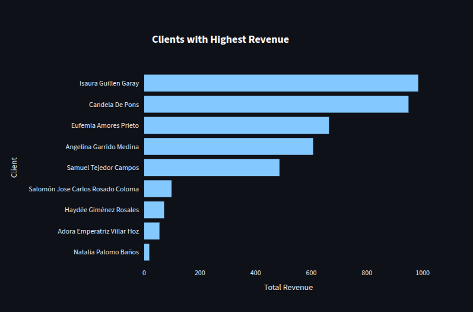
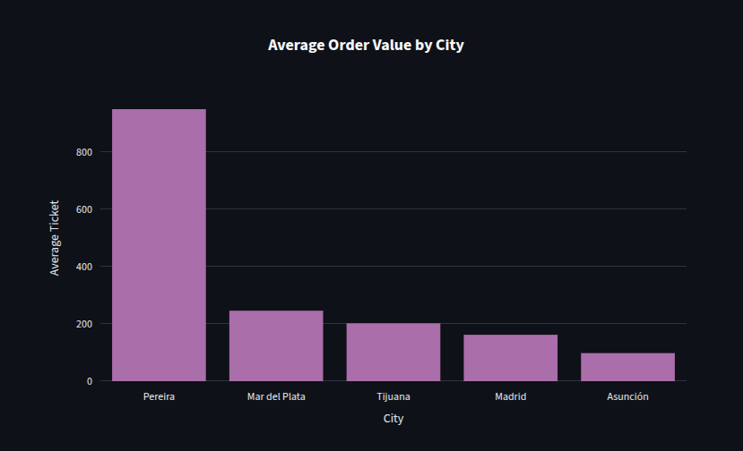
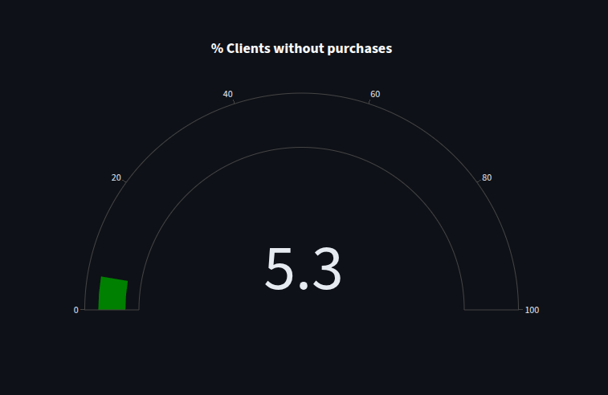
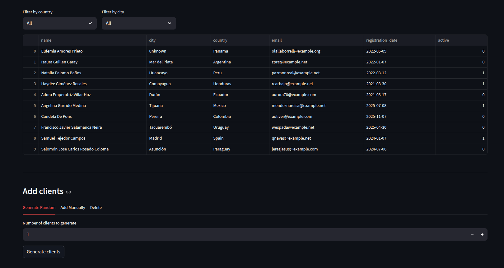
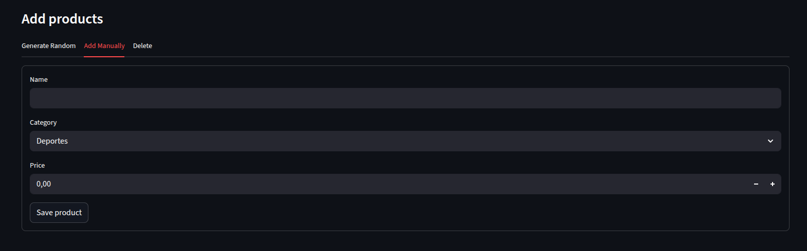

# E-Commerce Sales Analysis

## Interactive dashboard with the ability to generate new data (clients, products, orders), which will be displayed in real-time on the analysis charts

---

## Dashboard Preview

### Main Dashboard


_Main dashboard with KPIs and real-time charts_

### Sales by Month


_Monthly sales trends visualization_

### Top 5 Products by Revenue


_Best-selling products by category_

### Revenue Overview


_Total revenue analysis_

### Average Order Value by City


_Average order value per city_

### Clients Without Purchases


_Analysis of clients who haven't made any purchases_

### Client Management


_Client management interface_

### Add Data Manually


_Manual data entry functionality_

---

## Technologies Used

- **Python** — main language
- **Pandas** — data cleaning and transformation
- **SQLite** — relational database
- **Streamlit** — interactive dashboard
- **Plotly** — visualizations
- **Faker** — synthetic data generation

---

## Project Structure

```
ecommerce-analysis/
├── app/
│   ├── main.py               # Home page
│   └── pages/
│       ├── 01_dashboard.py   # KPIs and charts
│       ├── 02_clientes.py    # Client management
│       ├── 03_productos.py   # Product catalog
│       └── 04_ordenes.py     # Order history
├── data/
│   ├── raw/                  # Raw and dirty data
│   └── processed/            # Clean data
├── database/
│   └── ecommerce.db          # SQLite database
├── src/
│   ├── generate_data.py      # Synthetic data generation
│   ├── clean.py              # Data cleaning
│   ├── transform.py          # Transformations and merges
│   ├── analyze.py            # Analysis with Pandas
│   └── sql_queries.py        # SQL queries
└── requirements.txt
```

---

## How to Run the Project

**1. Clone the repository**

```bash
git clone https://github.com/hadron/ecommerce-analysis.git
cd ecommerce-analysis
```

**2. Install dependencies**

```bash
pip install -r requirements.txt
```

**3. Generate and process data**

```bash
python src/generate_data.py
python src/clean.py
python src/transform.py
python src/sql_queries.py
```

**4. Run the app**

```bash
streamlit run app/main.py
```

---

## Business Questions Answered

1. What is the top 5 best-selling products by category?
2. Which clients generated the most revenue?
3. What is the average order value per city?
4. Which month had the peak sales?
5. What percentage of clients made no purchases?
6. What is the repurchase rate by product category?

---

## Notes

- Data is synthetic generated using the `Faker` library
- The SQLite database is local — changes persist during the session
- For production deployment, it is recommended to migrate to PostgreSQL or Supabase
